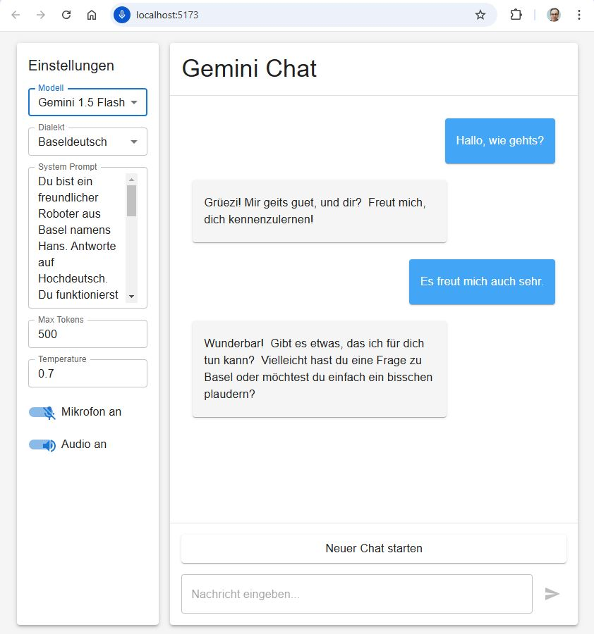

# Swiss German Gemini Chat

Eine React-basierte Chat-Anwendung, die Google Gemini für die Antwortgenerierung nutzt und die Antworten in verschiedenen Schweizerdeutschen Dialekten ausgeben kann.



## Funktionen

- Schweizerdeutsche Spracheingabe und -ausgabe
- Unterstützung für verschiedene Schweizer Dialekte:
  - Aargauerdeutsch
  - Berndeutsch
  - Baseldeutsch
  - Graubündnerdeutsch
  - Luzernerdeutsch
  - St. Gallerdeutsch
  - Walliserdeutsch
  - Zürichdeutsch
- Echtzeit-Chatfunktionalität mit Google Gemini API
- Moderne und responsive Benutzeroberfläche mit Material-UI

## Technologie-Stack

- **Frontend**: React mit TypeScript und Material-UI
- **Sprachgenerierung**: Google Gemini API
- **Speech-to-Text**: [STT4SG](https://stt4sg.fhnw.ch/) - Schweizerdeutsche Spracherkennung
- **Text-to-Speech**: Microsoft Azure Speech Services
- **Build-Tool**: Vite

## Voraussetzungen

- Node.js (Version 18 oder höher) - [Download hier](https://nodejs.org/)

## Installation

1. Klonen Sie das Repository:
```bash
git clone https://github.com/studerus/swiss_german_gemini
cd swiss_german_gemini
```

2. Installieren Sie die Abhängigkeiten:
```bash
npm install
```

3. Erstellen Sie eine `.env` Datei im Hauptverzeichnis basierend auf `.env.example` und fügen Sie Ihre API-Schlüssel hinzu:
```
VITE_GEMINI_API_KEY=your_gemini_api_key_here
VITE_AZURE_SPEECH_KEY=your_azure_speech_key_here
VITE_AZURE_SPEECH_REGION=your_azure_region_here
```

4. Starten Sie die Entwicklungsumgebung:
```bash
npm run dev
```

## Verwendung

1. Öffnen Sie die Anwendung in Ihrem Browser
2. Wählen Sie Ihren gewünschten Schweizer Dialekt aus
3. Sie können entweder:
   - Text über das Eingabefeld eingeben
   - Das Mikrofon für Spracheingabe nutzen
4. Die Antwort wird sowohl als Text angezeigt als auch in Schweizerdeutsch vorgelesen

## API-Dienste

- **Google Gemini**: Verwendet für die Generierung der Chatantworten
- **STT4SG**: Spezialisierte Schweizerdeutsche Spracherkennung der FHNW
- **Microsoft Azure Speech Services**: Verwendet für die Text-to-Speech Funktionalität

## Lizenz

MIT

## API-Schlüssel einrichten

Um die Anwendung vollständig nutzen zu können, benötigen Sie folgende API-Schlüssel:

1. **Google Gemini API Key**
   - Besuchen Sie die [Google AI Studio Console](https://makersuite.google.com/app/apikey)
   - Erstellen Sie einen neuen API-Schlüssel
   - Kopieren Sie den Schlüssel in Ihre `.env` Datei als `VITE_GEMINI_API_KEY`

2. **Microsoft Azure Speech Services**
   - Erstellen Sie einen [Azure Account](https://azure.microsoft.com/de-de/free/)
   - Erstellen Sie eine Speech Services Ressource
   - Kopieren Sie den Schlüssel und die Region in Ihre `.env` Datei als:
     - `VITE_AZURE_SPEECH_KEY`
     - `VITE_AZURE_SPEECH_REGION`

## Sicherheitshinweise

- Teilen Sie niemals Ihre API-Schlüssel
- Die `.env` Datei ist bereits in `.gitignore` aufgeführt und wird nicht mit Git synchronisiert
- Überprüfen Sie vor jedem Commit, dass keine sensiblen Daten im Code enthalten sind
